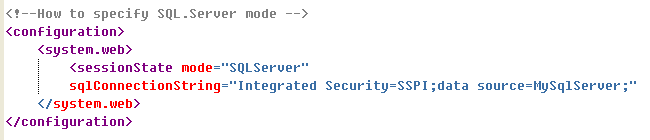

# This example shows how to manage states in an ASP.NET Web Application

<strong>Introduction</strong>

Most Web applications need to store, retrieve, and display information as a user navigates between the different pages that make up the web site. This type of information is known as state data, and is used to add coherence and functionality to the Web Application.
In a typical Web application, a user might visit a page and fill out a form, performing actions such as typing in text boxes, selecting option buttons, selecting items in drop-down lists, and so on. The user might then click a button to submit the information to the web application running on the server. Prior to ASP.NET, a Web page did not automatically preserve the information on the page after the submission.
The submission of control data to the same page is commonly referred to as <i>postback</i>, and the mechanism for storing the state of controls throughout the postback cycle is called ViewState. 

<strong>What is ViewState?</strong>

ViewState is the mechanism provided by ASP.NET for preserving the contents and the state of the controls on a Web Page when a user has entered data and submitted the form and when the page is re-displayed. You do not have to write code to implement ViewState; ASP.NET implements ViewState for you by storing the appropriate information in a hidden field on the form.

<strong>What is Control State?</strong>

If you are developing your own Web Server control, you can specify that it maintains state data even if ViewState is disabled for the page on which it runs. You can achieve this by working with the control's ControlState data. ASP.NET enables controls to preserve their <strong>ControlState</strong> even when <strong>ViewState</strong> is disabled.

<strong>The application Object</strong>

An ASP.NET application consists of the pages, files, handlers, and code that reside within a given virtual directory and its subdirectories. ASP.NET maintains a <strong>single Application</strong> object for each application on your Web server. This object is created in memory when the first user makes the first request to the application, and it remains in memory until the application is stopped. An application is stopped when the server is shut down, the Web Server is stopped, or the site (or Web Service) is stopped. An application can also be stopped by an application failure or when you deploy a new version of the application.

When an object is stored in the Application object, any page in the Web application can access it, regardless of which user has made the request. However, because the application can restart without warning, you should not use the Application object to cache critical information, and you should always check that a value exists in the cache before you attempt to use it.

<strong>Application Events</strong>

The <strong>Application</strong> object exposes three important events:

<ul>
<li><strong>Application Start:</strong> This event is raised when the first user makes the first request to a page in the application. If the server, Web service, or Web site has been restarted, this event will fire on the next request.</li>
<li><strong>Application End:</strong> This event fires when the server, Web service, or Web site is stopped or restarted. This event is a good place to clean up resources that the application has used. This event will not be raised if an application failure occurs.</li>
<li><strong>Application Error:</strong> This event is raised if an otherwise-unhandled exception occurs in the application. If the error is handled with a try...catch block, or at the page level, this event will not fire.This event is a good place to write code to handle any unexpected errors that may occur in the application.</li>
</ul>

To write handlers for these events, add a file called <strong>Global.asax</strong> to the root folder of your application, and then place the event handlers in it.

<strong>The Session Object</strong>

An ASP.NET Session object is an object that represents a user's visit to your application. A session begins when the user makes the first request for a page or file. Sessions usually expire when a configurable period of time has elapsed since the last request. You can set this time by using the <strong>Session.Timeout</strong> property. You can also end a session by calling the <strong>Session.Abandon</strong> method.
The <strong>Session</strong> object, as does the <strong>Application</strong> object, enables you to share values between ASP.NET pages. However, each user has his own <strong>Session</strong> object, so you should use the <strong>Session</strong> object only to store information specific to a user.

<strong>Session Events</strong>

The <strong>Session</strong> object exposes two important events:
<ul>
<li><strong>Session.Start: </strong>This event fires when a user begins a session in your application by requesting a page. It is a good place to initialize values that are specific to a user.</li>
<li><strong>Session.End:</strong> This event fires when a user session expires or when the <strong>Session.Abandon</strong> method is called.</li>
</ul>

<strong>Note</strong> The <strong>Session.End</strong> event is fired only when the default <strong>InProc</strong> mode is used for storing session state. If you are using <strong>StateServer</strong> mode or <strong>SQLServer</strong> mode, the event does not fire.

<strong>Strategies for managing Session State Data</strong>

You can store session state information in several locations. You can configure where to store session information by setting the mode attribute 
of the SessionState element in the <em>Web.config</em> file of your application. 
The possible storage modes are:

<ul>
<li><strong>InProc Mode</strong></li>
<li><strong>StateServer Mode</strong></li>
<li><strong>SQL Server Mode</strong></li>
</ul>
<b>In Proc Mode</b>

<strong>InProc</strong> is the default mode. Session state data is stored in memory on the Web server within the process that is running the Web 
application. InProc is the only mode that supports the <strong>Session.End</strong> event. However, if the application is restarted, session state information 
will be lost. Futhermore, session state in <strong>InProc mode cannot be shared between multiple servers</strong> in a Web farm.

<b>StateServer Mode</b>

In <strong>StateServer</strong> mode, session state data is managed by a separate process called the ASP.NET State Service. Separating the session data from 
the process running the application ensures that session state is not lost if an application is restarted. <strong>Multiple Web servers in a Web Farm</strong> can share a single
]session state server, a user's session is not tied to a specific process and different servers in the Web farm can handle a user's requests.

The ASP.NET State Service does not start automatically; you must ensure that it is running on the desired server if you want to use it. You must also configure each Web Server in the Web farm to connect to it by modifying the <em>Web.config</em> file. The following example shows how to specify a state server in the Web.config file:

The <strong>stateConnectionString</strong> attribute specifies the IP address or host name of the server that runs the ASP.NET State service, followed by the port number, which is 42424 by default.
The cookieless attribute governs whether cookies should be used to match users with their session state information. The <strong>AutoDetect</strong> value means that the Web server will use cookies only if they are supported by the browser. If cookies are not supported, a technique known as Url munging will be used to send and retrieve session state by using query  strings. Finally, the Timeout attribute used to send and retrieve session state by using query strings. Finally, the <strong>Timeout</strong> attribute specifies how long (in minutes) session information should be saved after the last user request. 

<strong>SQLServer Mode</strong>

In SQLSever mode, session state data is stored in a Microsoft SQL Server database. As does <strong>StateServer</strong> mode, this mode maintains state infromation if the application is restarted, and it can be accessed by multiple Web Servers in a Web farm. You can also use SQL Server clustering to create a highly available state storage solution.

To use <strong>SQLServer mode</strong>, you must first install the Session State Database on an existing SQL Server. ASP.NET includes the <em>aspnet_regsql.exe</em> tool to enable you to do this. The following command, for example, adds the database to a server called <em>MyServer</em>:

<tt>
aspnet_regsql.exe -S MyServer -E -ssadd
</tt>

Once this has been done, you must configure the application to use SQLServer mode. The following example shows how to specify <strong>SQLServer</strong> mode in the <em>Web.config</em> file:

<strong>The Cache Object</strong>

ASP.NET has a powerful caching system that you can use to improve the response time of your application. If an object consumes a lot of server resources during creation, you can create it once and then store in the cache. When the object is used again, it will already exist in the cache, so the Web server can respond more quickly.

The ASP.NET caching system automatically removes items when system memory becomes scarce, in a process called scavenging. For this reason, it is a good place to store large quantities of data that is expensive to generate and which is used by many clients. If, by contrast, you used the <strong>Application</strong> object to store a large object, the server could run out of physical memory and have to use the page file a lot, which would degrade the application's performance significantly. (The Application object should be used only for small objects or values.)

<strong>Caching Information</strong>

ASP.NET provides the <strong>Cache</strong> object to provide access to the application cache. You can add named values to the <strong>Cache</strong> object as in the following example:
<tt>
Cache["value1"] = "This is an example value";
</tt>

 

If Web server memory becomes scarce, the ASP.NET runtime automatically removes seldom-used items from the cache. If you try to access an object that has been removed from the cache, the cache will return a <strong>Null</strong> reference. You should always check for the <strong>Null</strong> reference before attempting to use a cached object; otherwise run-time exceptions can occur. You can influence the ASP.NET policy for removing objects by specifying a <strong>CacheItemPriority</strong> value when adding an item to the cache by using the <strong>Cache.Insert</strong> or <strong>Cache.Add</strong> methods.

<strong>Controlling Expiration</strong>

If a cached object is relevant for only a limited amount of time, you can specify an expiration time when you add the object to the cache. You can specify one of the following:

<ul>
<li>An absolute expiration time. A date and time when the object will be removed.</li>
<li>A sliding expiration time. The cache system will scavenge the item if it has not been used for a duration that exceeds this value.</li>
</ul>

The following examples show how to use the Cache.Insert method to add a value with an absolute expiration time of two minutes:

<tt>
Cache.Insert("value1","Example Text",null,DateTime.Now.AddMinutes(2),System.Web.Caching.Cache.NoSlidingExpiration);
</tt>

<strong>Cache Item Priority</strong>

You can specify a priority when you add an object to the cache. In most cases, the caching system will scavenge low-priority items before high-priority items when system memory becomes scarce.

<strong>Cache Dependencies</strong>

Cached items can become invalid because the source of the data has changed. For example, if you cache data from an XML file and the file changes, the cached item becomes out-of date. When you add items to the cache, you can specify files, directories, and other cache items on which they depend. If these objects change, the cached item is automatically removed. You can use this feature to ensure that the cache always contains the most up-to-date information.

The following example shows how to use Session and Cache objects.

<b>Fig 1 Running the example</b>

<b>Fig 2 Adding one record to the session and binds to the grid.</b>

<b>Fig 3 Adding more records</b>

